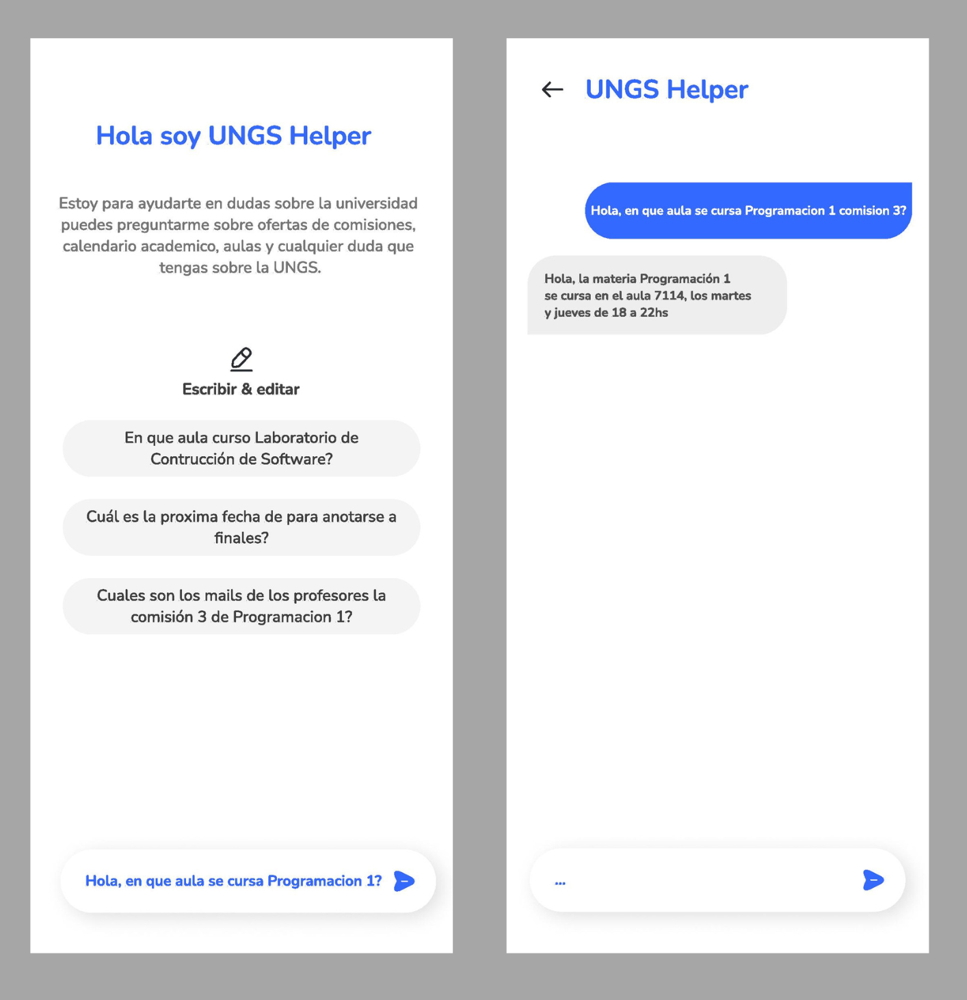

# Trabajo Práctico Entrega Inicial Laboratorio de Construcción de Software

El objetivo principal del trabajo práctico es la construcción de un Chatbot con IA orientado a un tema a elección.

### Chatbot

Nuestro Chatbot está enfocado en el ámbito universitario para facilitarle la vida académica a los estudiantes de la Universidad Nacional de General Sarmiento (UNGS), con funciones como, mostrar ofertas de comisión, brindar información básica sobre las materias, aulas de cursada, fechas de inscripción, entre otra información útil relativa a la universidad. Además de esto, se busca que el Chatbot pueda mantener una conversación con los estudiantes interpretando lo que envían y respondiendo adecuadamente. 

Para llevar a cabo este proyecto, se emplearán diversas herramientas. Utilizaremos el lenguaje de programación Python junto a diversas librerías. Como `aspose.pdf`, que permite la manipulación de archivos PDF de forma eficiente. Ayudándonos a la hora de realizar la conversión de archivos PDF a formato CSV y así poder alimentar a la IA con el uso de los PDF disponibles en la universidad, como el calendario académico, oferta de comisiones, entre otros. La librería pandas, para el análisis y manipulación de los archivos CSV, limpiar y transformar estos datos. Otra librería importante es `pythorch` o `tenserflow` (junto con `keras`), para el aprendizaje automático que nos servirán a la hora de entrenar a esta IA y además nos permitirá utilizando modelados de lenguaje para que pueda mantener una conversación con los estudiantes.

A continuación se muestran unos mockups de una posible vista final del Chatbot construido.

